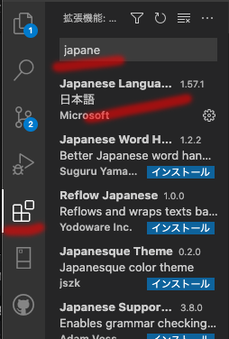

# How to set up Visual Studio Code / VS Codeのインストールから設定まで

## ダウンロードする

以下のサイトよりアプリをダウンロードしてください

[Visual Studio Code](https://code.visualstudio.com/)

最新版がお使いのOSで仕様できない場合は、以下のページより過去のバージョンをダウンロードしてください

[2021年1月（バージョン1.53）](https://code.visualstudio.com/updates/v1_53)

## 日本語表示にする

デフォルトでは英語表記なので、日本語化のライブラリをインストールした上で、設定を変更してください

1. 左のブロックのようなアイコンをクリックします

2. 検索ワードに"japanese"と入力する

3. 検索トップに憑依される"Japanese Language Pack for VS Code"をインストール

4. 使用法にしたがってVS Codeの言語設定をjaに変更する

>使用法
既定の UI 言語をオーバーライドするには、"Configure Display Language" コマンドを使用して、VS Code の表示言語を明示的に設定します。 "Ctrl+Shift+P" を押して "コマンド パレット" を表示し、"display" と入力して "Configure Display Language" コマンドをフィルターして表示します。Enter キーを押すと、インストールされている言語の一覧がロケールごとに表示され、現在のロケールが強調表示されます。UI 言語を切り替えるには、別の "ロケール" を選択してください。

## Gitをインストールする

ここではMac版のインストールを紹介します

1. アプリケーションフォルダ内のユーティリティ/ターミナルを起動します

2. コマンドラインに "git" と入力する

3. 画面の指示に従って、デベロッパ・ツールをインストールしてください

4. デベロッパ・ツールのインストール後、VS Codeを再起動することで、設定が反映されます

Windowsのインストール方法のほか、詳細は以下のサイトを参照してください

[Gitのインストール](https://git-scm.com/book/ja/v2/%E4%BD%BF%E3%81%84%E5%A7%8B%E3%82%81%E3%82%8B-Git%E3%81%AE%E3%82%A4%E3%83%B3%E3%82%B9%E3%83%88%E3%83%BC%E3%83%AB)

## ExtendScript Debugger Extension for Visual Studio Codeをインストールする

ExtendScriptの開発やバイナリ出力を行うためのライブラリをインストールします

日本語化の際にインストールしたように、左のブロックのようなアイコンから上記ライブラリを検索してインストールしてください

