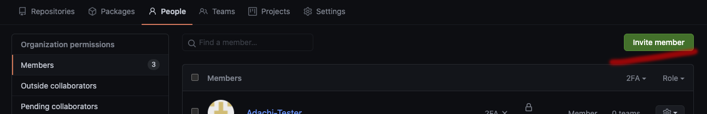
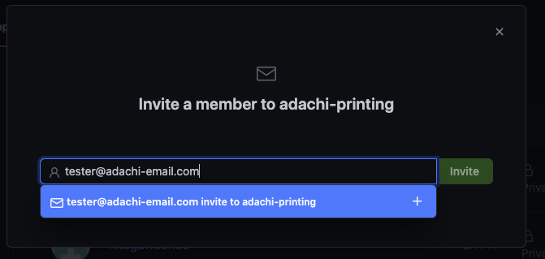
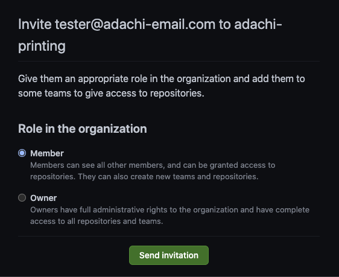
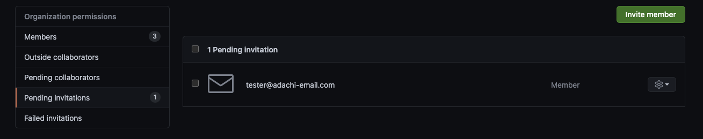

# GitHubでOrganizationに招待する / チームに招待

チームに招待して、private / 非公開リポジトリへのアクセスや、issue / 要望などの書き込みをしてもらいましょう

チームへの招待はオーナー権限を持つユーザのみが行えます

オーナー権限
の有無は、以下の参加ユーザー一覧から確認することができます

https://github.com/orgs/adachi-printing/people

## 招待の手順

招待には相手のユーザー名、もしくはメールアドレスが必要です

メールアドレスを使用する方が、似た名前が多いユーザー名を使用するよりも間違いが少ないと思うので、メールアドレスでの招待をお勧めします

### 招待メールを作成する

以下の画面より招待メール作成画面へ行くことができます

トップページのタブメニューより People をクリック

画面右側に配置された "Invite Member"のボタンをクリック

表示されたダイアログボックスに招待相手のメールアドレスを入力します

入力ボックス下部に "xxx@xxxx.xxx invite to xxxxx"と表示されるので、そちらを選択の上、右側の Invite というボタンをクリックします

### 招待相手の権限を選択します

上記画面で、招待相手の権限を選択して、Send invitationのボタンをクリックしてください

基本的には Member で招待してください

Owner権限はメンバーの招待、除外、リポジトリの公開設定など様々な権限が与えられます

招待メールの送信に成功すると、招待中の一覧に招待相手が追加されます

一覧画面では招待の取り消しなどが行えます
