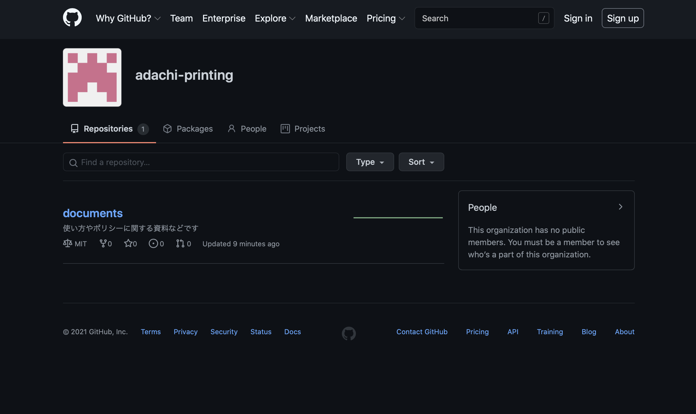
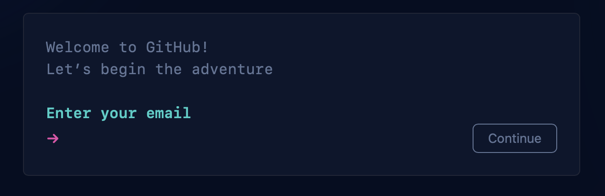
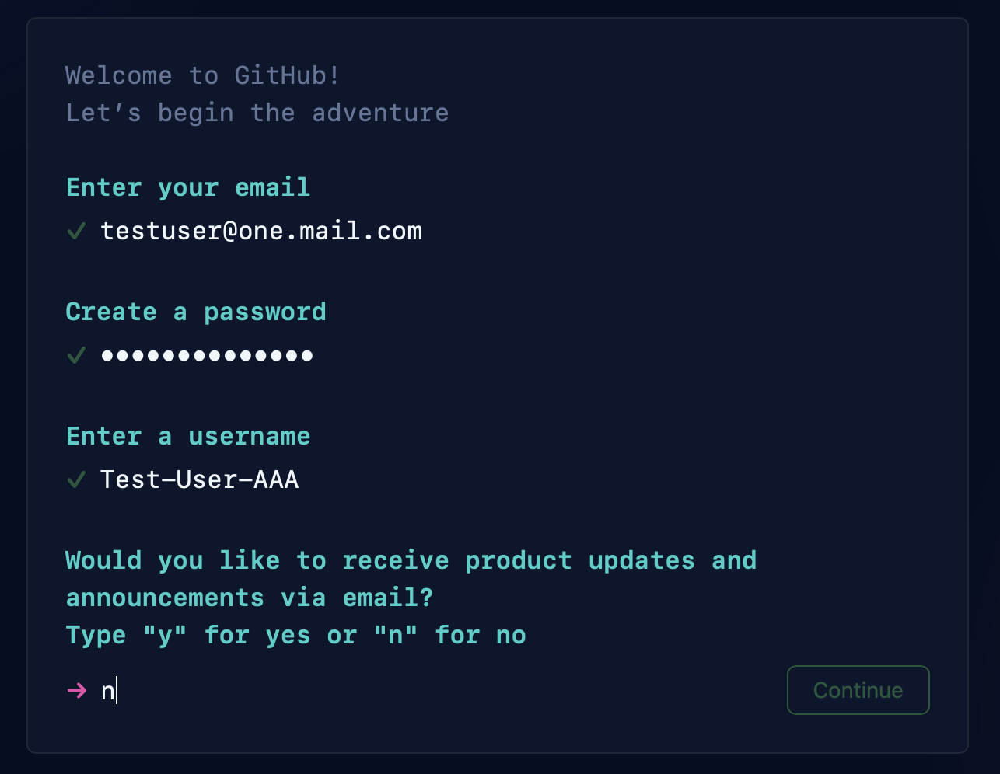
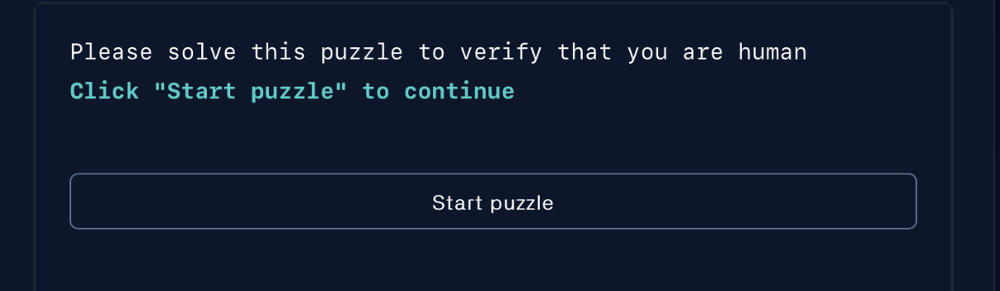
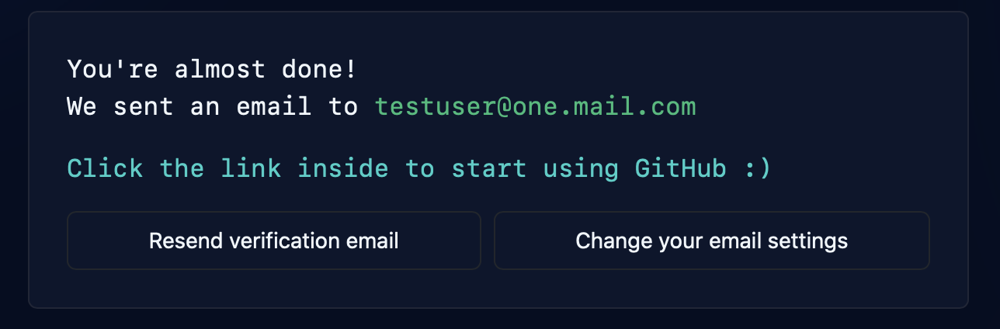
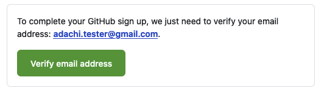
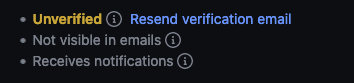

# Gitの登録方法

## サインアップ / 基本情報入力

1. 画面右上にある[Sign up]のボタンをクリックしてください

2. アカウント登録に使用するメールアドレスを入力して、Continueのボタンをクリックしてください

仕事やプライベートで登録するメールアドレスを使い分けると良いでしょう

3. つづけてパスワードを入力してください

4. つづけてお好きなユーザー名を入力してください

5. 最後にダイレクトメールを受け取るか否かを入力してください

6. 必要事項が入力した後、ロボットによる自動入力化を判定する画面になります
Start puzzleのボタンを押して質問に答えてください
（この記事執筆時では銀河系の写真を選択するクイズになっています）

7. 無事、クイズに答えると、"Create account"のボタンが出てきます
上記のボタンをクリックして、登録が完了します

##　ベリファイeメール / メールアドレスの検証

登録した直後は、一部の機能が制限された状態になっています。

制限を解除するために、eメールの検証を行なってください

1. 登録直後に出てくる画面にて "Resend verification email" のボタンをクリックしてください

2. GitHubよりメールが届くので、本文中の"Verify email address"をクリックしてください

3. 表示されたページに以下の文字が表示されていなければ成功です

Unverifiedと表示されている場合は検証に失敗しているので、
しばらく待ってからもう一度検証を行うか、GitHubへ問い合わせてください