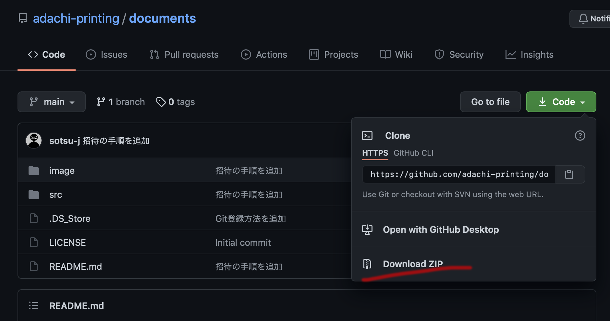

# How to download the repository / ファイルのダウンロード方法

スクリプト / ソースファイルのダウンロード方法にはいくつかの種類があります

## Web / ブラウザからダウンロードする

### リポジトリ全体をダウンロード

目的のリポジトリに移動すると下記のような画面になります

画面右側の

というボタンをクリックすると追加のメニューが出てきます

追加メニューから Download ZIP をクリックすることで、リポジトリ全体をZIP形式に圧縮した状態でダウンロードすることができます

### 個別にファイルをダウンロード

リポジトリ内の特定のファイルのみをダウンロードする場合は、目的のファイルまでリンクを辿った上で、画面右側の Raw と書かれたボタンをクリックします

ソースファイルが表示される画面になるので、その画面上で右クリックなどで選択できる”名前をつけて保存”や"別名で保存"などを使って保存してください

ただし、この方法を使った場合、テキストファイルとして扱われてしまい、拡張子が.txtなどになってしまうので、その場合は適宜修正してください

## コマンドでダウンロードする

ご利用のパソコンにgitがインストールされている状態なら、MacのターミナルやWindowsのコマンドプロンプト上でダウンロードできます

目的のリポジトリ画面で表示されている というボタンをクリックするとURLが表示されます

URLの右側のコピーボタンでURLをクリップボードにコピーします

その後、ターミナルやコマンドプロンプト上で以下のようなコマンドを実行してください

$ git clone https://github.com/[xxx]/[yyy].git

[xxx]や[yyy]の部分は目的のリポジトリにより変化します

## VS Codeでダウンロードする

MicrosoftのVisual Studio Code(VS Code)を使ってダウンロードすることができます

VS Codeを用いることで、ダウンロードだけでなく、スクリプトの編集なども行うことができます

- [Visual Studio Code](https://azure.microsoft.com/ja-jp/products/visual-studio-code/)

